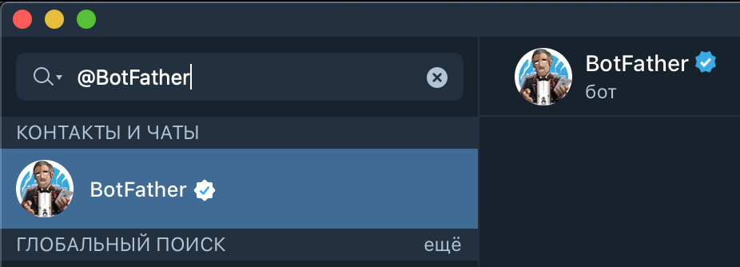
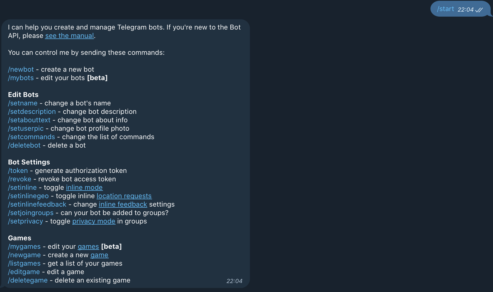
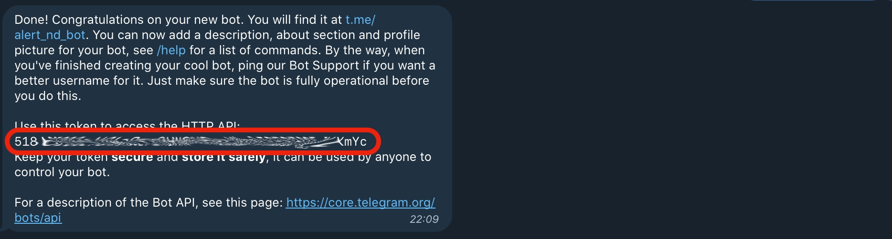
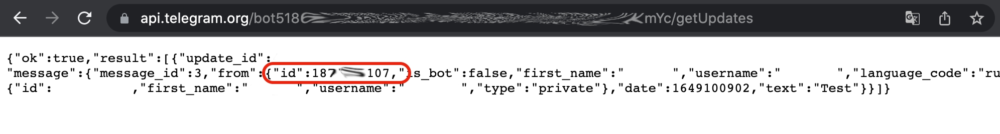

# HAQQ task "False alarm!" manual

## Phase 1
We will use a telegram bot to monitor the operation of the node and to notify you when you are in jail.

First, create a bot in the Telegram app. Type @BotFather into the search box and click «Start».



To create a new bot, click on /newbot



Come up with and enter a name, then come up with a username for our bot in the format "name_bot". Many of them will be busy, look for free ones. After entering the name, we get an API token. Save it.



Now we need to know the user_id. This is the ID of the chat to which we will send the notifications we need. To do this, search for our bot in the app (enter @name_bot in the search box), go in and click «Start». 
Write any message, go to https://api.telegram.org/bot{token}/getUpdates in any browser, changing {token} to the saved API token.



Save the id. Now we have everything we need to send messages, the only thing left is to run the script on the server where haqq node stands.

## Phase 2

Let's start by updating and installing the missing packages:
```
sudo apt update && sudo apt upgrade -y
sudo apt install build-essential jq wget git htop curl screen nano -y
```
Create a new session for screen:
```
screen -S TB
```
Now create a file to run the script:
```
nano tb.sh
```
In the window that opens, insert:
```
#!/bin/bash
ADD_V=haqqvaloper... #Enter your valoper address
TGID1=XXX...XXX #Enter your user_id
TGAPI=XXX:XXX...XXX #Enter your API token
DELAY=500 #Time in seconds per cycle
PR=26657 #Enter your RPC port which uses haqq
SN=haqqd
NAME=HAQQ
for (( ;; )); do
CP=$(cat /proc/loadavg | awk '{print $1}')
MD=$(df -m | grep "/dev/" | head -1 | awk '{print $1}')
FS=$(df -m | grep -w "$MD" | awk '{print $5}')
MU=$(free | grep "Mem" | awk '{print $3}')
MT=$(free | grep "Mem" | awk '{print $2}')
MU=$(($MU / 1000))
MT=$(($MT / 1000))
VB=$(curl -s localhost:${PR}/status | jq -r .result.sync_info.latest_block_height)
PJ=$(${SN} query staking validator ${ADD_V} --node tcp://localhost:${PR} --output json | jq .jailed)
VP=$(curl -s localhost:${PR}/status | jq -r .result.validator_info.voting_power)
echo -e "Check on the block ${VB} | VP=${VP}"
if ([ $PJ = false ]); then
curl -s -X POST --connect-timeout 10 "https://api.telegram.org/bot${TGAPI}/sendMessage?chat_id=${TGID1}&text=✅ ${NAME} ${VB} | VP=${VP} | CP=${CP} | ${MU}-${MT}  | US=${FS}"
echo -e "TB SEND 1"
else
curl -s -X POST --connect-timeout 10 "https://api.telegram.org/bot${TGAPI}/sendMessage?chat_id=${TGID1}&text=❌ ${NAME} IN JAIL"
echo -e "TB SEND 2"
fi
for (( timer=${DELAY}; timer>0; timer-- ))
do
printf "* sleep for %02d sec\r" $timer
sleep 1
done
done
```
Save by successively pressing "CTRL+X" "Y" "ENTER" Now you have to set the permission to run with the command:
```
chmod +x tb.sh
```
Run the script:
```
./ap_tb.sh
```
We check the telegram bot, he should get a message like this:


VP - voting power, CO - Load Average, XXX-.... - amount of virtual memory used, -XXX - how much total virtual memory, XX% - amount of disk space used.

If your validator goes to jail, you will get a message of types:


